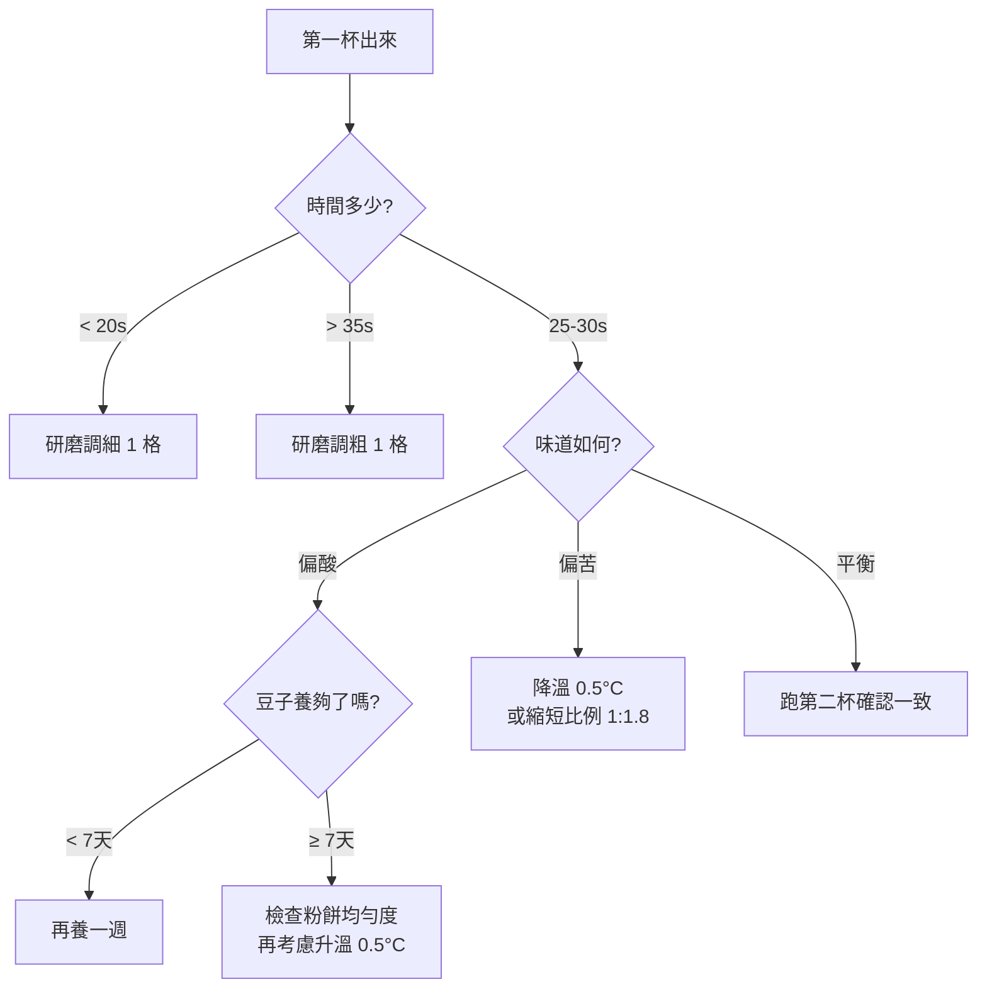

## 開豆 SOP 的目的

拿到一包陌生的新豆，目標是用最少的次數把它調到「三杯一致、味道平衡」的狀態。這篇是〈[brewing-science/開豆起手式](../../brewing-science/10-dial-in-baseline)〉的義式專屬深化版，聚焦「在家用義式機從零到穩定」的完整流程。

整個 SOP 分四個階段：

1. 開豆前的準備
2. 第一杯：建立基準線
3. 根據第一杯調整
4. 達到穩定的標準

## 一、開豆前的準備

### 確認豆況

- **烘焙日期**：建議養豆 7-14 天後再開。新鮮豆 CO₂ 含量高，萃取會被氣體擾動，杯感不穩
- **烘焙度**：偏深焙先試 1:2，偏淺焙可從 1:2.2 起手
- **保存狀態**：開封後若放超過 4 週，杯感會明顯變化，記錄時要標註開封日

### 清潔機器

開新豆前，把上一支豆的殘粉與痕跡清乾淨：

1. 反洗沖煮頭（backflush，視機器頻率）
2. 沖煮頭沖水 5 秒
3. 換新豆前，磨豆機跑掉約 5 g「過渡粉」（清掉舊豆殘粉）
4. 粉碗、把手、撥粉工具全部擦乾淨

### 確認水溫穩定

- PID 雙鍋爐機：開機等 15 分鐘
- HX 機種：開機等 25-30 分鐘，沖煮前先放水降溫
- 沒有 PID 的機器：做 temperature surfing（觀察加熱燈循環）

水溫不穩，後面所有調整都是雜訊。

## 二、第一杯：建立基準線

### 起手式參數

不要改、先跑一杯：

| 項目 | 起手值 |
|---|---|
| 粉量 | 18 g（依粉碗容量調整，但**不要動**）|
| 目標液重 | 36 g（1:2 比例）|
| 目標時間 | 25-30 秒 |
| 水溫 | 93°C |
| 研磨度 | 上一支豆的設定 ± 0.5 格 |

研磨度的起點，可以從上一支豆的刻度開始。全新機器或豆款差異很大，從一個中等刻度起手（例如多數家用磨豆機的「義式區」中段）。

### 第一杯的記錄

完整記錄第一杯所有資訊：

```
日期：2026-05-29
豆款：A 衣索比亞水洗
烘焙日：2026-05-15（養豆 14 天）
研磨刻度：#8
粉量：18.0 g
目標液重：36 g

實際液重：32 g
實際時間：38 秒
crema：偏深、油亮
味道：苦、乾、無甜感
```

實際液重 32 g 而不是目標 36 g，表示時間到 30 秒就停泵但水還沒流完，研磨太細卡死。

## 三、根據第一杯調整

### 決策樹



### 每次只動一個變因

新手最容易出錯的就是同時動兩個變因。這次調細了研磨，下一杯就只看研磨改變的影響，不要順便升溫或改比例。

### 變因調整優先順序

1. **研磨度**（影響最大、最先動）
2. **豆量微調**（最後 0.2-0.3 g 的微調，不要動超過 1 g）
3. **比例**（從 1:2 拉到 1:1.8 或 1:2.2）
4. **水溫**（最後動，每次 ±0.5°C）

研磨度永遠先動。研磨度沒對，溫度與比例的微調都是雜訊。

<espresso-debug-tree></espresso-debug-tree>

## 四、穩定的標準

連續三杯達到下列條件，這包豆才算「開好」：

| 指標 | 容許範圍 |
|---|---|
| 時間差 | < 2 秒 |
| 液重差 | < 1 g |
| 味道一致 | 平衡度、酸甜苦比例一致 |

達到這個標準後，記錄當下的全部參數，往後做這支豆都用這組設定起手。

## 記錄格式建議

開豆過程的所有杯子都要記。一個校正通常會有 5-10 杯記錄，這些記錄是後面做奶咖、做純飲調整的基礎。

| 日期 | 粉量 | 液重 | 時間 | 研磨刻度 | 水溫 | 味道描述 | 備註 |
|---|---|---|---|---|---|---|---|
| 2026-05-29 | 18.0 | 32 | 38s | #8 | 93°C | 苦、乾 | 第一杯，研磨太細 |
| 2026-05-29 | 18.0 | 36 | 33s | #9 | 93°C | 偏苦但有甜 | 調粗 1 格 |
| 2026-05-29 | 18.0 | 36 | 28s | #10 | 93°C | 平衡、餘韻長 | 達標 |
| 2026-05-29 | 18.0 | 36 | 27s | #10 | 93°C | 平衡 | 第二杯確認 |
| 2026-05-29 | 18.0 | 36 | 28s | #10 | 93°C | 平衡 | 第三杯確認 |

最後三杯時間落在 27-28 秒、液重 36 g 不差、味道一致 → 開豆完成。

## 開豆後可以做的事

達到穩定之後，這包豆才有資格進入下面的玩法：

- **嘗試 ristretto / lungo 比例**：用同一個研磨度，跑 1:1.5 與 1:3 看豆子的甜感區間
- **用來做奶咖**：基底已經穩定，奶咖的不一致幾乎都來自蒸奶
- **比較不同水溫**：±1°C 的影響，在豆子穩定後才能客觀觀察

開豆沒穩定就直接做奶咖，會有兩個問題在打架：「espresso 不穩」+「蒸奶不穩」，根本分不清是哪一邊出問題。

## 開豆失敗的常見原因

| 現象 | 真正原因 |
|---|---|
| 怎麼調都酸 | 豆子太新，CO₂ 還沒排乾 |
| 怎麼調都苦 | 豆子過老，已經氧化 |
| 時間怎麼都跑不到 30 秒 | 磨豆機刻度不夠細，需要更細 |
| 三杯時間差超過 5 秒 | 動作不穩、puck prep 沒固定 |
| 味道飄忽不定 | 機器水溫不穩、未充分預熱 |

反覆調整都到不了穩定，先檢查不是參數問題，是上面這些根本變因。

:::warning[「再養幾天試試」是有上限的]
新豆養豆建議 7-14 天，但超過 14 天還是怎麼調都酸澀，問題可能不是養豆不夠，是這支豆的烘焙度本身對你的機器與水質不適合。換豆是合理選項。
:::

:::tip[把開豆當作建立資料庫]
每包豆的校正記錄都留著。半年後翻記錄會發現：「這個產區的豆子大多落在 #9-#10 刻度」、「這家烘豆師的中焙都需要 1:2.2 才會甜」。記錄是經驗的累積方式。
:::

:::kuro
[Kuro 自己填：某包豆的開豆記錄，從第一杯到穩定的完整過程]
:::
